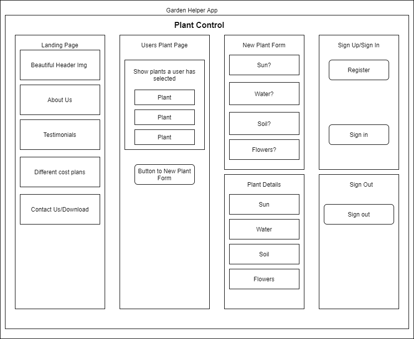

/cdn.vox-cdn.com/uploads/chorus_image/image/65893827/secret_garden_xl.0.jpg)

# Garden Helper

### Capstone Project for Epicodus, 09.25.2020

## By Benjamin Russell

## Description

This application will allow a user to filter an API query with information about their type of garden. The user will be then be able to see a list of plants that fit their specifications. The user will be able to choose from the list of plants the ones they want most and save them to their own page. A plant can be deleted if the user decides they do not want it saved to their page any longer. 

## Capstone Proposal

Name: Benjamin Russell

Title: Garden Design Helper

Description: Take info from a user that will help them decide the best plants for their type of garden. Will filter based on type of soil or how much they want to water and what can survive in their hardiness zone. 

Use Case: The main users are people who are new to gardening looking for plants that will fit the style of yard they would like to cultivate. They will filter the plants from the API with form inputs, choosing whether they would like plants that need a lot of water or little to none. Plants that are tolerant of shade or like full sun and plants that need well drained soil or plants that are more tolerant of high levels of clay in the soil.

Minimum Viable Product:
 
* Take user inputs and return plants that match
* Properly filter Api call 
* Show images of plants to user  

Technology for MVP:

* React.js Frontend
* C# API custom build

Stretch Goals:

* Allow a user to make an account to save plants they like 
* Allow users to comment on the plants they have saved 
* Allow users to upload images of the plants in their gardens 
* Implement search capability to search for other users or specific plants a user would like to add

Additional Technology for Stretch Goals:

* Firebase for NoSQL database, User Authentication, and Hosting
* TBD

Additional Information: This is my original team week idea, but now I have so many more tools to really make this project the way I originally imagined it. I will make sure not to use any of the code that we used for the first team week.

## Specifications

| Behavior | Input | Output |
| -------- | ----- | ------ |
| 1. As a user, I want to see a list/menu of all available kegs. For each keg, I want to see its name, brand, price and alcoholContent. |  | List of all Beers on Tap List |
| 2. As a user, I want to submit a form to add a new keg to a list. | Add New Tap button | New Tap appears on list |
| 3. As a user, I want to be able to click on a keg to see its detail page. |  | Pfriem IPA details |
| 4. As a user, I want to see how many pints are left in a keg. | Pour button | 123 pints left |
| 5. As a user, I want to be able to click a button next to a keg whenever I sell a pint of it. This should decrease the number of pints left by 1. Pints should not be able to go below 0. | Pour button | Out of Stock |

## Setup/Installation Instructions

* Clone this repository to your project directory https://github.com/brussell36/TapRoom.git
* Run `npm install`
* Run `npm start` to start a development server to view the project.

## Known Bugs

_No known issues. Please contact me if you have any problems._

## Support and contact details

Please feel free to contact me through GitHub (username: brussell36) with any questions, ideas or concerns. 

## Technologies Used

* React.js
* Webpack
* Visual Studio Code 
* Git and Git BASH 
* JSX
* HTML
* BootStrap
* CSS

### License

*This site is licensed under the MIT license.*

Copyright (c) 2020 **_Benjamin Russell_**
